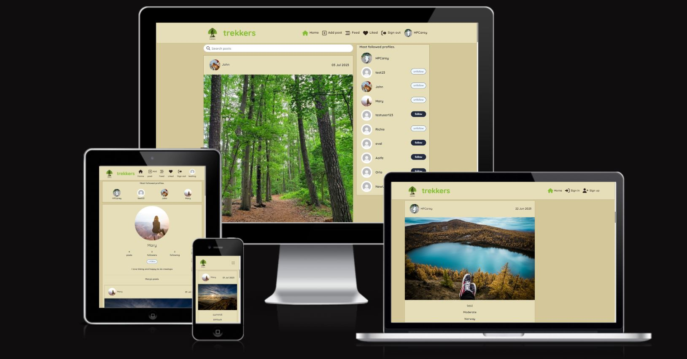
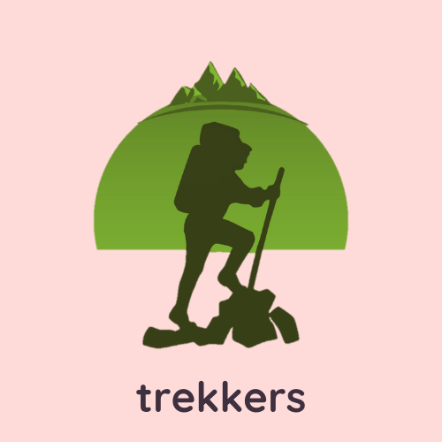
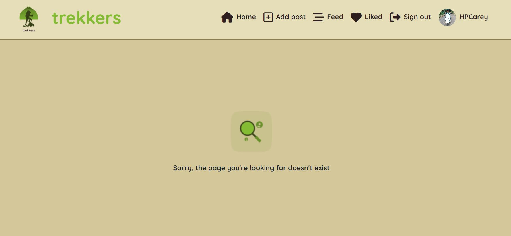

# Trekkers

Trekkers is a social media platform for hikers and people who love the outdoors. It was created using React and Django Rest Frameowork. The purpose of the site is to allow users to share posts about trails they like in their local area or hiking trips they've taken. 

#

* [Deployed Front-End page](https://trekkers.herokuapp.com/)
* [Deployed Back-End page](https://pp5-trekkers-api.herokuapp.com/)
* [Backend repository](https://github.com/HPCarey/pp5-trekkers-api)

## **Contents**
- [**Planning and Project Conception**](#planning-and-project-conception)
	- [**Project Goals**](#project-goals)
	- [**Site Goals**](#site-goals)
	- [**Future Goals**](#future-goals)
		- [**GitHub Project Board**](#github-project-board)
		- [**Github Issues**](#github-issues)
		- [**Wireframes**](#wireframes)
		- [**List of Wireframe pages**](#list-of-wireframe-pages)
	- [**Epics**](#epics)
		- [Authentication](#authentication)
		- [Navigation](#navigation)
		- [Posts](#posts)
		- [Comments](#comments)
		- [Profiles](#profiles)
	- [**User Stories**](#user-stories)
		- [**Epic 1: Authentication**](#epic-1-authentication)
		- [**Epic 2: Navigation:**](#epic-2-navigation)
		- [**Epic 3: Posts**](#epic-3-posts)
		- [**Epic 4: Comments**](#epic-4-comments)
		- [**Epic 5: Profiles**](#epic-5-profiles)
	- [**Design**](#design)
		- [**Images**](#images)
		- [**Colour Scheme and Accessibility**](#colour-scheme-and-accessibility)
		- [**Typography**](#typography)
- [**Features**](#features)
	- [**Existing Features**](#existing-features)
	- [**logo**](#logo)
	- [**custom 404 page**](#custom-404-page)
	- [**Future Features**](#future-features)
- [**Technologies**](#technologies)
	- [**Languages used**](#languages-used)
	- [**Databases**](#databases)
	- [**Cloud storage and deployment services**](#cloud-storage-and-deployment-services)
	- [**Frameworks, tools and libraries**](#frameworks-tools-and-libraries)
		- [**API Back-End**](#api-back-end)
		- [**Front-End**](#front-end)
	- [**Installed packages, libraries and componenets**](#installed-packages-libraries-and-componenets)
- [**Components**](#components)
- [**Testing**](#testing)
	- [**Manual Testing**](#manual-testing)
	- [**Test cases**](#test-cases)
	- [**Integration Testing**](#integration-testing)
	- [**Code Validation**](#code-validation)
- [**Bugs**](#bugs)
	- [**Bugs encountered during development**](#bugs-encountered-during-development)
	- [**Bugs and issues encountered during testing**](#bugs-and-issues-encountered-during-testing)
	- [**Unresolved bugs**](#unresolved-bugs)
- [**Gitpod set up and deployment**](#gitpod-set-up-and-deployment)
	- [Set-up in gitpod](#set-up-in-gitpod)
	- [Initial Deployment](#initial-deployment)
	- [Deployment issues and bugs](#deployment-issues-and-bugs)
	- [Connect the Frontend app with the Backend API](#connect-the-frontend-app-with-the-backend-api)
	- [Final Deployment](#final-deployment)
	- [Cloning](#cloning)
	- [Forking](#forking)
- [**Credits**](#credits)
	- [Code Institute](#code-institute)
	- [Resources for creating the star rating component:](#resources-for-creating-the-star-rating-component)
	- [Bug fix sources:](#bug-fix-sources)


## **Planning and Project Conception**
### **Project Goals**
- The aim of this project was to build a Frontend application using React and to become familiar with developing  applications using component based architecture.
- This project was built with the use of resuable react-bootstrap components such as the navbar component, dropdown menu, card, media etc. 
- As well as reusability, React allows for faster rendering and imporved performance by using a virtual DOM that only updates and renders the necessary components of the UI when the user interacts with the site and many of the custom components built in this app take adavantage of this and appear throughout the site without needing to be reloaded or are reused in various parts of the site.
For example:
   -  The PopularProfiles component which like the navbar is displayed on most of the pages without reloading every time.
   -  The PostsPage component which is reused for the Home, Feed and Like pages. 
- Another aim of this project is to connect a frontend app to a backend api.
- Django Rest Framework was used to create RESTful APIs for the Frontend app.
- In the drf api, django models are converted into JSON by defining serialisers.
- These models are the architecture for the custom components for the frontend app such as the Post component. 
- Authentication, permissions and url routing is configured to manage api access in the backend.
- The React Frontend app is using axios to make http requests to the api endpoints.
- ReactRouter is implemented for UI-end routing to allow users to navigate between site pages.
- To see how to connect the Frontend App and the Backend Api, please see [this](#connect-the-frontend-app-with-the-backend-api) part of the deployment section.
- To  review the drf Backend api endpoints and methods enabling CRUD functionality, please see the [backend repo](https://github.com/HPCarey/pp5-trekkers-api).

[Back to top](#contents)

### **Site Goals**
- To build an online community around a common interest of being outdoors, walking and hiking.
- To allow community members to share picture and information regarding trails and hikes they've done.
- To allow commnunity members to follow other users whose content is interesting to them.
- To allow users to save posts that are interesting to them about trails they would like to do. 
- To allow users to easily search for trails by difficulty and location so they can find posts relevant to their needs.

### **Future Goals**
- To implement event features so that community members can use the site to organise hikes and walks in their local areas or arrange hiking holidays/trips.
- To make the current features more useful by providing google maps locations and directions.
- Allow users to interact more efficiently by implementing private messaging.

[Back to top](#contents)
#

 
#### **GitHub Project Board**

This project was devised using agile methodologies.
Epics, user stories, bugs and issues are recorded on the [Project Board](https://github.com/users/HPCarey/projects/5/views/1).


[Back to top](#contents)

#### **Github Issues**
Here is a [link](https://github.com/HPCarey/trekkers/issues?q=is%3Aissue+is%3Aclosed) to the project issues and labels. 
* A list of Frontend Bugs can be viewed via the [Frontend Bug label](https://github.com/HPCarey/trekkers/issues?q=label%3A%22Frontend+Bugs%22+is%3Aclosed). 
* A list of backend bugs can be viewed via the [Backend bug label](https://github.com/HPCarey/trekkers/issues?q=label%3A%22Backend+Bugs%22+is%3Aclosed).
* A list of all bugs can be viewed via the [bugs label](https://github.com/HPCarey/trekkers/issues?q=label%3Abug+is%3Aclosed).


#### **Wireframes**
 * The plan for this project is based on the Code Institute Moments walkthrough project. 
 * Most of the UI is based on the same kind of features and functionality but customised for the specific purposes of this site
 * Initial plans were to include an event model, but that has been assigned as a future feature to help focus on the minimal viable product of  the site. 

#### **List of Wireframe pages**
- [Home page](readme/home_page.png)
- [Sign up page](readme/sign_up_page.png)
- [Sign in page](readme/sign_in_page.png)
- [Create post form](readme/create_post_form.png)
- [Profile page](readme/profile_page.png)

[Back to top](#contents)
#
### **Epics**
#### [Authentication](#epic-1-authentication)
#### [Navigation](#epic-2-navigation)
#### [Posts](#epic-3-posts)
#### [Comments](#epic-4-comments)
#### [Profiles](#epic-5-profiles)


### **User Stories**

#### **Epic 1: Authentication**

1. Sign up: As a **user** I can **create an account** so that I can **access all the site features**
 
2. Sign in: As a **user** I can **login** so that I can **access features only available to logged in users**

3. Sign out: As a **user** I can **logout** so that I can **exit my account and prevent others from gaining access**

4. Refreshing access tokens: As a **user** I can **maintain my logged in status for 24 hours** so that I can **easily interact with the app throughout the day**.

5. Create admin panel: As a **site owner** I can **access the admin panel** so that **I have access to all site features and functionality**.

6. Create superuser: As a **site owner** I can **create a superuser** so that **I can give admin users access to the admin panel**.

[Back to top](#contents)
#### **Epic 2: Navigation:**

7. As a **user** I can **quickly view my logged in/out status in the navbar** so that I can **decide on my next action**
 
	
8. Routing: As a **user** I can **view the navbar on every page** so that I can **easily navigate through the site**.

9. Conditional Rendering: As a **logged out user** I can **view sign in and sign up options** so that I can **easily tell whether I am logged in and can log in easily if not**.

10. Avatar: As a **logged in user** I can **view my profile link and avatar image on the navbar** so that I can **quickly see that I am logged in**

11. Popular profiles list: As a **logged in user** I can **view other user’s profile names and avatars** so that I can **easily identify and follow other users**

[Back to top](#contents)

#### **Epic 3: Posts**
12. Create a post: As a **logged in user** I can **create a new post** so that I can **share my experiences and suggestions for good hikes and walks I’ve been on**.

13. Edit a post: As a **logged in user** I can**edit my post** so that I can **revise my content**

14. Delete a post: As a **logged in user** I can **delete my post** so that I can **remove content I have posted**

15. View all posts: As a **user** I can **view all posts** so that I can **see what trails other users have walked and how they were**

16. View post detail: As a **user** I can **view individual post details** so that I can **view other details and comments about the post**
 

17. Like a post: As a **logged in user** I can **like a post** so that I can **quickly show my appreciation for another users content**

18. View liked posts: As a **logged in user** I can **view liked posts** so that I can **easily find the posts about trails that interested me**

19. Search posts: As a **user** I can **search posts** so that I can **find a post by author, trail name or location**

[Back to top](#contents)
#### **Epic 4: Comments**
20. Create a comment: As a **user** I can **leave a comment under a post** so that I can **express my opinion and engage with the content and the community**

21. Comment date: As a **user** I can **see the comment date** so that I can **know how long a go a comment was left**

22. View comments: As a **user** I can **view other comments** so that I can **see what others have said**

23. Edit comments: As a **user** I can **edit my comment** so that I can **revise the information**

24. Delete comments: As a **user** I can **delete my comment** so that I can **remove it from the post**
 
[Back to top](#contents)
#### **Epic 5: Profiles**
25. Profile page: As a **user** I can **view another user’s profile page** so that I can **see their posts and their bio**
 

26. User stats: As a **user** I can **see stats via a user profile** so that I can **see how many posts/followers/following/comments they have**

27. Follow/Unfollow a user: As a **logged in user** I can **follow other users whose content is more relevant or meaningful to me** so that I can **view content filtered by the users I follow**


28. Edit Profile: As a **user** I can **edit my profile** so that I can **update my personal details**
 
29. Update username and password: As a **user** I can **update my username/password** so that I can **make alterations as needed**

[Back to top](#contents)
### **Design**

#### **Images**
 
* Images of trails I used to populate the site were all taken from free photo stock on [Pixabay](https://www.pixabay.com/)

#### **Colour Scheme and Accessibility**
 * I designed the color scheme around the logo which I used canva to color. I wanted to go with a foresty green color palette. 

 * I got the colors for the backgrounds from these color palettes on [Schemecolor](https://www.schemecolor.com/):
- [Pallete 1](https://www.schemecolor.com/forest-tones.php)
- [Pallette 2](https://www.schemecolor.com/paint-color-combination.php)

#### **Typography**
* I also used canva to decide on the typography along with the design for the logo.
* I went with Quicksand font which I thought was very minamalist but soft due to the rounded edges. 

[Back to top](#contents)

## **Features**
### **Existing Features**
* For a comprehensive list of all site features, their function and UI design, please refer to the [User Stories Testing](/TESTING.md#user-stories-testing) section of the [TESTING.md](/TESTING.md) document. 

### **logo**
* Logo was designed by this artist [ItalianLadyBug](https://pixabay.com/users/italianladybug-27190605/).
* [This](https://pixabay.com/illustrations/hiking-mountain-adventure-travel-7459908/) is the source for the design I found on pixabay.
* I used [Canva](https://www.canva.com/) to adjust the color to my liking and to add the site name.
* The logo was used as the favicon for the webpage as well as the navbar logo home link.



[Back to top](#contents)
#

### **custom 404 page**
* The 404 page let's user's know they are still connected to the site but on a non-existent page. 



[Back to top](#contents)
#
### **Future Features**
* An Events Feature similar to the Posts feature, whereby users can post about trail meetups and hikes in their local area so users can use the site to arrange real world meetups.
   * The plans for this feature have already been designed in the wireframes and erd model plans.
   * In the [home page](readme/home_page.png) wireframe, the navbar has been designed to have an events page link and a dropdown nav menu for the add post and add event form links. 
   * Here are the event feature wireframes I designed for this: 
      - [Event Page](readme/event_page.png)
      - [Create Event Form](readme/create_event_form.png) 
   * This future feature could still have a comment component similar to posts, but instead of a like button there would be an "interested in" and a "going" button. These would work as a toggle button much in the same way the like button and follow buttons function.
   * For events with limited capacity there could be a "going to" max value limit that prevents users from clicking id the event has reached capacity.
   * Google map api integration would be good for this too so that people can easily plan  their trips to the trail locations.
* Private messaging would be a good feature for a site like this, especially once event organisation becomes a feature.
* Social Account sign in using apis to allow users to login via their email accounts rather than going through the whole sign up process.

[Back to top](#contents)

## **Technologies** 
### **Languages used**
- [Python](https://www.python.org/) 

- [HTML](https://www.w3schools.com/html/html_intro.asp)

- [CSS](https://www.w3schools.com/css/css_intro.asp)

- [JS](https://reactjs.org/)

### **Databases**
- [Postgresql](https://www.postgresql.org/)

### **Cloud storage and deployment services**
- [Cloudinary](https://cloudinary.com/)
    - Used to store media files and images.
- [Heroku](https://www.heroku.com/)
    - Used to host the deployed sitewhat
- [ElephantSQL]() 
    - Used to host and operate the PostgresSQL database

[Back to top](#contents)

### **Frameworks, tools and libraries**
#### **API Back-End**
- [Django Rest Framework](https://www.django-rest-framework.org/)
- [Psycopg2](https://pypi.org/project/psycopg2/)
- [django_filters](https://django-filter.readthedocs.io/en/stable/guide/install.html) 
- [dj_rest_auth](https://dj-rest-auth.readthedocs.io/en/latest/installation.html)
- [rest_framework.authtoken](https://pypi.org/project/django-rest-authtoken/)
- [dj_rest_auth.registration](https://dj-rest-auth.readthedocs.io/en/latest/installation.html)
- [allauth](https://django-allauth.readthedocs.io/en/latest/installation.html)
- [corsheaders](https://pypi.org/project/django-cors-headers/)
- [JSON WEB tokens](https://django-rest-framework-simplejwt.readthedocs.io/en/latest/getting_started.html)


[Back to top](#contents)
   
#### **Front-End**
- [React JS](https://reactjs.org/)
- [JSON Web Tokens](https://jwt.io/)
- [React Bootstrap](https://react-bootstrap-v4.netlify.app/)
- [react-simple-star-rating](https://www.npmjs.com/package/react-simple-star-rating/v/4.0.5)
- [React Router](https://v5.reactrouter.com/web/guides/quick-start)
- [Font Awesome](https://fontawesome.com/)
- [Canva](https://www.canva.com/)
- [Favicon.io](https://favicon.io/favicon-converter/)
- [Schemecolor](https://www.schemecolor.com/)
- [Pixabay](https://pixabay.com/)
- [Google fonts](https://fonts.google.com/)
- [Markdown TOC generator](https://magnetikonline.github.io/markdown-toc-generate/)

[Back to top](#contents)

### **Installed packages, libraries and componenets**

- React
   - npx create-react-app . --use-npm
   - Main JavaScript framework for creating the UI
- Node 
   - Package manager used to install dependencies
- React simple star rating: 
   - npm i react-simple-star-rating@4.0.5
   - Star rating component as a rating field in the Posts model. 
- React Router: 
   - npm install react-router-dom
   - Handles routing of the React app:
       - Keeps the UI in sync with the URL and only renders components required by whichever URL path the user navigates to.
- Axios library:
   - npm install axios
   - Tells React app to send requests to the api
- React Infinite scroll
   - npm install react-infinite-scroll-component
   - Used with list pages instead of pagination
   - Utilised by posts and comments when there are long lists of these components
- jwtDecode library: 
   - npm install jwt-decode 
   - Stops unneccessary network requests every time unauthenticated user interacts with the app.
   - Stores the logged in user's refresh token timestamp in the browser using localStorage.
   - Then check if this timestamp exists and only if it does make attempt to refresh access token.

[Back to top](#content)


## **Components**
Below are some components not featured in user stories testing but which have been implemented within this project that have been reused throughout the project:

1. axiosDefault.js : Send http request to the backend API in the case of user crud actions or get requests for a specific object or list of objects.
2. Asset.js : exports the loading spinner when/where requied in the site.
3. Avatar.js exports users' avatar image to the popular profileslist, profile page and navbar profile link. 
3. MoreDropdown.js : displays menu to authorised users with options to edit/delete Posts, comments and profile details. 
4. CurrentUserContext.js : confirm users logged-in status to determine what functionality is available to that user.
5. ProfileDataContext.js : provide un/follow ability to authorised user via popular profiles componenet and profile page component.
6. useRedirect.js : redirects a user to another page if they are not authorised to be on the page they are trying to access.
7. useClickOutsideToggle.js : Implemented for the mobile dropdown nav component, which allows users to close the expanded navbar by tapping/clicking outside the navbar. 
   - It hasn't been reused for another feature yet but will be for future feature. 
   - One of my future feature will potentially crowd the navbar with too many navlinks so I am planning to use a dropdown menu in the desktop navbar and will have to implement it for that feature eventually. 
   - See the [Home page wireframe](readme/home_page.png) for this design feature 

8.  utils.js : supplies functionality to all of the components that utilise the Infinite Scroll.

[Back to top](#contents)


## **Testing**

The testing documentation can be viewed [here](/TESTING.md)

[Back to top](#contents)


## **Bugs**
### **Bugs encountered during development**
* I have recorded the primary bugs and issues encountered during the development process in the [issues](https://github.com/HPCarey/trekkers/issues?q=is%3Aissue+is%3Aclosed)  and [Project Board](https://github.com/users/HPCarey/projects/5/views/1).
* The solutions and sources for solutions to the bugs encountered can also be found there.
   * A list of Frontend Bugs can be viewed via the [Frontend Bug label](https://github.com/HPCarey/trekkers/issues?q=label%3A%22Frontend+Bugs%22+is%3Aclosed). 
   * A list of backend bugs can be viewed via the [Backend bug label](https://github.com/HPCarey/trekkers/issues?q=label%3A%22Backend+Bugs%22+is%3Aclosed).
   * A list of all bugs can be viewed via the [bugs label](https://github.com/HPCarey/trekkers/issues?q=label%3Abug+is%3Aclosed).

[Back to top](#contents)
### **Bugs and issues encountered during testing**
* The bugs encountered during the manual test phase were as follows: 
1.	Follow/unfollow buttons on the profile pages needed a top margin so a class was made in the button styles module just to target these. 
2. Comment form submit/update error:
   -  After user created or edited a comment and clicked "post" or "save", the post detail page would display a blank white page. 
   - Upon refreshing the page the comment had been correctly created/updated but every time the button was clicked to perform these actions the post detail page would go blank.  

   **Fix**: 
   - After investigating routes and comment forms, I located the problem in the  PostPage.js, so the problem was with the post detail code not the comment form. 
   - I was able to locate the issue by refering back through my original walkthrough project code for this component.
   - The variable "post" was missing the property "results" in the usestate hook.
   - It was set to:
   ```
    const [post, setPost] = useState({});
   ```
   - I think I may have adjusted this while trying to troubleshoot another issue, so I changed it back to:
   ```
     const [post, setPost] = useState({ results: [] });
   ```  
   - I also had to set the array to "post" in the useEffect hook:
   ```
    setPost({ results: [post] });
   ``` 
   - And add results array to the Post component: 
   ```
   <Post {...post.results[0]} setPosts={setPost} postPage />
   ```
This fixed the comment form post request error.

[Back to top](#contents)

### **Unresolved bugs**
1. The star rating component bug for the edit form: 
   - This bug is recorded in the project board as it appeared during development.
   - It was partly resolved but not completely.
   - Initially the value of the orginial posts rating was not being passed to the edit form at all
   - The user had to input a star rating value every time they wanted to edit the post, even if they wanted to edit a different field and keep the star rating the same. 
   - Without a new value for rating the edit form would not be validated and would throw a missing required field error.
   - The stars were not filled in to display the pre-populated value to the user.
      
   **Fix**:
   - I managed to pass the value of the original post rating to the edit form so that it didn't need to be updated for the form to be validated by passing it to the handleMount function inside the useEffect hook and the setPostData. and using setRating(rating) to pass the fetched rating data and store it in the rating variable. 
   - I then tested the rating value in the edit form to see if it would remain the same as the original post rating value if not updated by the user in the edit form and it passed.
   - I checked that the value would be updated to a new value if the user input a new star rating and it passed.
   - I thought this would resolve the issue completely but I could not manage to get the stars to display the filled in value of the rating. 
   - After trying a lot of different things and refering back to the component documentation, I had to leave this issue partly unresolved.
   - It would be preferable for the user to see the star rating original value in the edit form, but at least this value is being passed and can be updated or left as is without interfering with the form validation.

[Back to top](#contents)
#
2. Sticky follow/unfollow buttons:

   - During the manual testing phase I discovered that sometimes the follow-unfollow button for certain profiles got "sticky".
   - Certain profiles follow buttons did not always allow me to toggle between follwo-unfollow many times before getting stuck, while other profiles seemed to always allow this. 

   **Fix**:
      - After doing a code review and using an eslinter to clean up some code and removing typos and commented out code, I found that the sticky follow button issue had resolved for all but one profile.
      - The profile "testUser123" does not always work when I click it. It does not toggle between follow/unfollow and the followers count does not change. 
      - In the dev tools console, a 400 (Bad Request) error displays saying failed to load resource.
      - This profile was not created by me but either by my mentor or by an assessor from the previous submission. 
      - I'm not sure why only this one profile is affected but the other profile follow buttons are behaving as expected without any console errors and I have had to leave this one as unresolved for now.

[Back to top](#contents)


## **Gitpod set up and deployment**
- This project was created and developed using gitpod using the following steps: 
### Set-up in gitpod
   - Navigate to your github repository page and click the green "new" button to create a new repo.
   - choose a name with all lower case letters: trekkers
   - Click the green "create repository" button.
   - Click the Green "Gitpod button to create a workspace.
   - Enter the following commands:
      - npx create-react-app . --use-npm
      - npm install -g npm@9.6.6
   - Run npm start to check the app is working.
   - Add extension to help manage the code:
      - ES7 React/Redux/GraphQl/React-Native : (snippets) by dsznajder
      - Prettier : (Code formatter) by esbenp
   - Commit  and push to github tr prepare for initial deployment.

[Back to top](#contents)
#
### Initial Deployment
- Navigate to heroku for initial deployment
- Click on the "new" dropdown and select "Create new app"
- Give the app a name and select the region, I selected Europe for this app. 
- Click the Create app button 
- Under the "Deploy" tab, click on github for deployment method and connect the app to the [trekkers](https://github.com/HPCarey/trekkers/tree/main) github repositiory.
- Once the app  is connected to the correct github repository, click "Deploy Branch" and open the app in the browser to make sure it works. 

### Deployment issues and bugs
- I did not use the CI gitpod template as it was not availabe and the instructions had changed after the codeanywhere switch.
- As a result I encountered a lot of issues installingpackages and deployment/ app running issues. 
- A full report of these issues and the solutions I implemented can be seen in the [issues](https://github.com/H88PCarey/trekkers/issues) and [Project Board](https://github.com/users/HPCarey/projects/5/views/1).

[Back to top](#contents)

### Connect the Frontend app with the Backend API
- In order to connect not only the deployed Frontend app but also the development version of the app, we need to provide both heroku and local urls to the API on heroku.
- This was done using the following steps: 
1. Navigate to the deployed Backend api on heroku and go to the "Settings" tab.
2. Set two new Config Vars with the following key:value: 
   - CLIENT_ORIGIN : https://trekkers.herokuapp.com 
   - CLIENT_ORIGIN_DEV : https://3000-githubname-appname-435h43j34h543h-eu101.gitpod.io
      - Note that the CLIENT_ORIGIN_DEV value might need to be updated in the Config Vars as this is not a permanent value and may change during development.
   - The CLIENT-ORIGIN-DEV in this example is not an actual local url for security reasons. 
- Next we need to tell the Frontend app where to send requests to.
- This was done using the Axios library using the following steps: 
1. Install the Axios library : npm install axios.
2. Create an api folder inside the src folder and inside create an axiosDefaults.js file. 
3. Set the baseURL to the deployed api,and set the content type and Credentials.


      
4. Import into App.js: 
```
   import "./api/axiosDefaults";
```

[Back to top](#contents)
#
### Final Deployment
- In GITPOD IDE:

1. Remove React.StrictMode component from index.js.
2. Optimise bootstrap imports by making sure each component is imported individually:
Example:

   ```
   import Navbar from "react-bootstrap/Navbar";
   import Container from "react-bootstrap/Container";
   import Nav from "react-bootstrap/Nav";
   ```
3. Remove console.logs
   - note: I am following the advice of the moments walkthrough instructions and have left the console.logs inside the catch blocks commented out fr easy access to debug things later.

4. Add the Heroku deployment commands in package.json in the "scripts" section.
```
   "heroku-prebuild": "npm install -g serve",
```
Note: Due to some dependency conflicts I have an opesnssl legacy provider tag on the start and build commands in the scripst sectionof package.json. 
- This needs to be removed before the deployment commit and push or the heroku deployment build will fail. 
- If you want to run this app locally and there is an error, check if the openssl legacy provider tag is there and if not add it according to the below example: 
```
   "start": "react-scripts --openssl-legacy-provider start",
   "build": "react-scripts --openssl-legacy-provider build", 
```
- If you wish to make changes and deploy, remember to readjust these values before committing:
```
   "start": "react-scripts start",
   "build": "react-scripts build",
```
Please see the bugs for full details of this issue.

5. Add a Procfile to the root of the project with the following command: 
```
web: serve -s build
```
6. After pushing the final version to GitHub, navigate to the app on heroku.
      - Under the deploy tab, scroll to the bottom of the page and click the "Deploy Branch" button.
      - Ensure the build is successful and open the app.
      - Test all feautures in in the final deployed app to make sure everythin is the same and working as it should. 

[Back to top](#contents)

#

### Cloning
Here are the steps to clone the repository:
Navigate to the GitHub Repository you want to clone to use locally:

- Click on the code drop down button
- Click on HTTPS
- Copy the repository link to the clipboard
- Open your IDE of choice (git must be installed for the next steps)
- Type git clone copied-git-url into the IDE terminal

The project will now have been cloned on your local machine for use.

Install Dependencies:

```npm install```

Run Application:

```npm start```

[Back to top](#contents)
#

### Forking
Here are the steps to fork the repository:

- Navigate to the GitHub Repository you want to fork.

- On the top right of the page under the header, click the fork button.

- This will create a duplicate of the full project in your GitHub Repository.

[Back to top](#contents)

## **Credits**
### Code Institute
This project is a variation and laregely based on the [Code Institute Moments](https://github.com/Code-Institute-Solutions/moments) walkthrough project.
It contains styles and logic from that project which have bee modified for the prupose of this one.

### Resources for creating the star rating component: 
1.	[NPMJS: react-simple-star-rating]( https://www.npmjs.com/package/react-star-ratings) 
2. Geeksforgeeks: [Posititive Integer field](https://www.geeksforgeeks.org/positiveintegerfield-django-models/)
2.	Stack overflow: [Set a default min/max value for inetger field](https://stackoverflow.com/questions/42425933/how-do-i-set-a-default-max-and-min-value-for-an-integerfield-django)

### Bug fix sources:
1. Due to a change in material by Code Institute to reflect their new IDE provider, I did not have access to the template for gitpod. As a result I had to deal with a lot of bugs in the setup and deployment stage, and any time a package needed to be installed. The list of sources for this as well as my troubleshooting steps and solutions can be found under the "Frontedn bug" label in [Issues](https://github.com/HPCarey/trekkers/issues).

2. Downgrade React version [Dev.to]( https://dev.to/ifeanyichima/how-to-downgrade-from-react-18-to-1702-818)

3. Css validator warning explanations from TESTING.md:
   1. [vendor extended pseudo-element warning source](https://stackoverflow.com/questions/21889767/warnings-from-w3c-validation-for-css-cant-find-the-warning-message-for-vendor)
   2. [The property clip is deprecated warning source]()

4. Hide "choose file" button for images off screen with css .Hide class [source](https://stackoverflow.com/questions/6746649/how-can-i-hide-an-element-off-the-edge-of-the-screen#:~:text=Just%20add%20overflow%3Ahidden%20to,That%20should%20do%20the%20trick.).


[Back to top](#contents)

