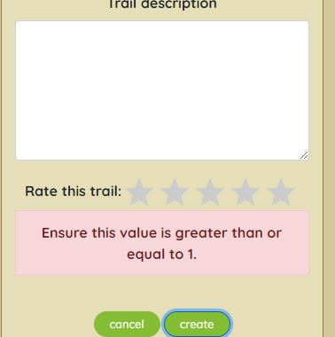
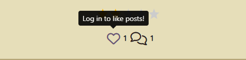
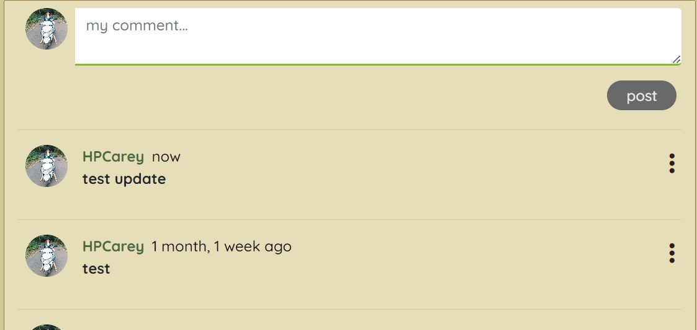

## **Manual Testing**

* This site was tested manually by:
    - Testing the UI and functionality of features for different device sizes and browsers.
    - Evaluating performance and loading times using lighthouse and interacting wiht the site as a user.
    - Ensuring that user story features are functioning as they should be with the expected outcome from specific user actions.
    - All links and user pathways function as intended and navigate the user as expected through the site.
* The details of how the manual testing was carried out can be seen below.
* I have also included the code validation in the TESTING document.

## Responsive Testing

👇

* Site resonsivity was tested using google chrome DevTools and with my own Galaxy S20 FE 5G.
* The screenshot below shows a list of the devices that were tested. 

    

* The site was shown to be fully responsive, readable and functional on all of the tested devices.
* One minor issue showed up with the buttons on the update form page which did not display side by side but rather one above the other on the Surface Pro, iPad mini, iPad Air and the Galaxy fold. This appeared to be a minor issue only affecting UI design and not functionality or readability. On most devices it displayed correctly.

* Site resposivity was also tested on Amiresponsive as seen in the README.
* I also included some screenshots of features in mobile size in the user story testing to show the responsive design. 

[Back to top](#testing)

- - -
## Lighthouse testing

👇

* Lighthouse testing in chrome DevTools showed an overall performance of 99% and good SEO and Accessibility scores.
* There were some suggestions to improve best practice scores which will be added to the future features for this site.

    

[Back to top](#testing)

- - -

## Browser testing

👇

* The site was developped using Google Chrome browser and tested in Firefox and Microsoft Edge.

[Back to top](#testing)

- - -

## User Stories Testing

👇

The User Stories and features were continuously tested during development and this testing was documented here and with screenshots of the features from the deployed site.

### Epic 1: Authentication

User Stories test cases

 

#### **User Stories**
1. Sign up: As a **user** I can **create an account** so that I can **access all the site features**
    - Sign up page allows new users to create an account.
    - Handles errors for duplicate username, blank fields or mismatching passwords.
    - Tested all links working as normal. 
    - The link to the sign in page will redirect user to sign in page.
    - If all form fields are valid and user clicks sign up they will be redirected to the sign in page.

    
    
    

[Back to top](#testing)

#
2. Sign in: As a **user** I can **login** so that I can **access features only available to logged in users **

    - Sign in page allows users who have created an account to sign in in order to access all the site features.
    - Handles errors for incorrect credentials and blank fields.
    - Tested all links working as normal. 
    - The link to the sign up page will redirect user to sign up page as expected.
    - If all form fields are valid and user clicks sign in, they will be redirected to the homepage.

    
    
    
    
    

[Back to top](#testing)
#

3. Sign out: As a **user** I can **logout** so that I can **exit my account and prevent others from gaining access**
    - The Navbar displays a sign out button to logged in users so that they can sign out from any page in the site.

    

    - When the user clicks the sign out button they are redirected to the home page.
    - Once logged out the Navbar will change to reflect the users ogged out status and provides the links to sign in and sign up.

    

[Back to top](#testing)
#
4. Refreshing access tokens: As a **user** I can **maintain my logged in status for 24 hours** so that I can **easily interact with the app throughout the day**.

    - Unless users click the sign out button, they remain logged in for 24 hours.

[Back to top](#testing)

#

5. Create admin panel: As a **site owner** I can **access the admin panel** so that **I have access to all site features and functionality**.anel can be accessed by those with the superuser credentials.

  - This is a Backend api feature, please see the relevant readme [here](https://github.com/HPCarey/pp5-trekkers-api).

[Back to top](#testing)

6. Create superuser: As a **site owner** I can **create a superuser** so that **I can give admin users access to the admin panel**.

  - This is a Backend api feature, please see the relevant readme [here](https://github.com/HPCarey/pp5-trekkers-api).

[Back to top](#testing)

- - -

### Epic 2: Navigation

User Stories test cases

 

#### **User Stories**
7. As a **user** I can **quickly view my logged in/out status in the navbar** so that I can **decide on my next action**

    - The Navbar displays a home, sign in and sign up link to logged out users so they can choose to interact with the site on a read only basis or sign in/up to access more features
    

    - Once signed in the navbar gives the user access to other actions and pages such as add post, liked posts, feed and the users profile link with their avatar.
    

[Back to top](#testing)
#
8. Routing: As a **user** I can **view the navbar on every page** so that I can **easily navigate through the site**.

    - The Navbar has been tested on every page and in different screen sizes. 
    - The navbar is fully responsive and fully functional.
    - Active navlinks are in green  to help the user know which page they are currently on.
    - When the user hovers over a navlink it will go green like the active navlink to help user know which link their mouse is over.
    - Both the logo and site name act as home navlinks to make it convenient and easy to get back to the home page.

     
     
    

[Back to top](#testing)
#

9. Conditional Rendering: As a **logged out user** I can **view sign in and sign up options** so that I can **easily tell whether I am logged in and can log in easily if not**.

    - Already established in test case 7.

[Back to top](#testing)

10. Avatar: As a **logged in user** I can **view my profile link and avatar image on the navbar** so that I can **quickly see that I am logged in”

    - Already established in test case 7.

[Back to top](#testing)

11. Popular profiles list: As a **logged in user** I can **view other user’s profile names and avatars** so that I can **easily identify and follow other users**

    - The popular profiles list is displayed on the right of the screen for desktop users and at the top just under navbar for mobile users.
    - Profile avatars act as links to other users profiles, all these links have been tested and redirect to the correct profiles.

    

[Back to top](#testing)

- - -

### Epic 3: Posts

User Stories test cases

 

#### **User Stories**
12. Create a post: As a **logged in user** I can **create a new post** so that I can **share my experiences and suggestions for good hikes and walks I’ve been on**.

    - Logged in users have access to the add post form and can create a post about their trail.

         
    
    - Each add post form handles errors for blank, required fields and for incorrect field values.

         
         
         

    - Images over 2mb will throw an error to conserve cloud storage space.
            

    - Once an image has been uploaded to the form a change image utton will appear to allow user to change the image.
        
    - There is a dropdown menu containing 4 choices of difficulty level with the default value set to easy.

        

    - A star rating value is also requires a value of at least 1 out of 5 stars.

        

    - Once the user clicks create and all fields are valid, the post will be published to the homepage and the user's profile page.
    - Once the user clicks create they are redirected to the post detail page, where they can take further actions related to the post.
    - If the user clicks cancel instead of create, they will be redirected to the home page instead.

[Back to top](#testing)

13. Edit a post: As a **logged in user** I can**edit my post** so that I can **revise my content**

    - Post owners have the ability to edit their posts from the post detail page via the three dot dropdown menu.

        

    - The edit form has all the original values pre-populated in the form fields, with the exception of the star rating value which does not display the stars filled in. 
        - note: the original value is still passed to the edit form and if the user adjusts other values the original rating value will remain, but it is an unsolved bug that the stars don't display the value in the edit form. 
    - The same field errors are handled as in the add post form but as the fields are pre-populated the blank field error only occurs for trail name and country when the user physically deletes the value and leaves them blank. 
    - All fields have been tested to see if the edited value is updated as expected and in each case they pass. 
    - If all form fields are valid and the user clicks save, they are redirected to the post detail again.
    - If the user clicks cancel in this case they will be redirected to the post details page.

    

[Back to top](#testing)

14. Delete a post: As a **logged in user** I can **delete my post** so that I can **remove content I have posted**

    - Post owners have the ability to delete their posts via the post detail page.
    - Post detail displays a three dot dropdown menu to users who are the post owner.
    - If the user clicks delete the post will be removed from the site and the user will be redirected to whatever page they navigated to the posts detail from, ie. their own profile or the home page.
    - In the Backend API the post model has an ondelete cascade so all comments and likes associated with the post will be deleted.

    

[Back to top](#testing)

15. View all posts: As a **user** I can **view all posts** so that I can **see what trails other users have walked and how they were**

    - All posts are avaialable to be viewed by both logged-in and logged-out users via the home page.

    

[Back to top](#testing)

16. View post detail: As a **user** I can **view individual post details** so that I can **view other details and comments about the post**

    - All users can view the post detail of individual posts.
    - All users can view the comments under the post and see how many likes the post has. 
    - Only logged in users will have the ability to post a comment or like a post.

        

[Back to top](#testing)

17. Like a post: As a **logged in user** I can **like a post** so that I can **quickly show my appreciation for another users content**

   - Logged-in users can like posts via the home page, post detail page or their feed.
   - Clicking the heart icon will add the post to liked posts and fills in the heart icon with a red color.
   - The likes count for the post will go up by 1.
            
        
        

- Clicking the heart icon again will remove the post from liked posts and will remove the filled in red colour.
- The likes count for the post will go down by 1.

    

    
    

- Logged-out users cannot like posts.
    

- Users cannot like their own posts.
    

[Back to top](#testing)

18. View liked posts: As a **logged in user** I can **view liked posts** so that I can **easily find the posts about trails that interested me**

   - Logged-in users can view their liked posts page to easily find trails they are interested in and want to keep easily accessible by liking.
            
        
        

[Back to top](#testing)

19. Search posts: As a **user** I can **search posts** so that I can **find a post by author, trail name or location**

   - The search bar allows users to search for posts by keywords including post author, location, country, trail name, difficulty.
   - It funtcions and displays correclty on all screen sizes, on the homepage, feed and liked page. 
   
      
      

   - The search function returns relevant posts as expected according to the user's search words.
        
        

   - User's can also refine the search by using more than one keyword.
        

   - If the users search keywords don't match any posts an error message is displayed iinforming the user to adjust the search term. 
            
        
        

[Back to top](#testing)

- - -

### Epic 4: Comments

User Stories test cases

 

#### **User Stories**
20. Create a comment: As a **user** I can **leave a comment under a post** so that I can **express my opinion and engage with the content and the community**

    - Logged-in users have access to a comment form via the post detail page.
    - Clicking the comment icon underneath a post will redirect the user straight down to the comments form on the post detail page, but the user can also access it by simply clicking on the post and scrolling down manually.

        

    - Once a user types something and clicks post in the comment form, the post detail page will display the newly published comment. 

        
        

[Back to top](#testing)

21. Comment date: As a **user** I can **see the comment date** so that I can **know how long a go a comment was left**

    - The amount of time since the comment was first created or last updated is published beside the comment to show users how old the comment is.

        
        

[Back to top](#testing)

22. View comments: As a **user** I can **view other comments** so that I can **see what others have said**

    - As mentioned in previous test cases, both logged-in and logged-out users can view comments made by other users under the post. 

        
        

[Back to top](#testing)

23. Edit comments: As a **user** I can **edit my comment** so that I can **revise the information**

    - If the user is the owner of a comment, a three dot dropdown will be displayed in the right hand corner of the published comment.
    - This dropdown menu contains the icon-link to open the edit comment form. 
    
    
    - If the user makes a change to the comment and clicks the save button, the post detail page will display the updated comment and updated time. 
    - If the user clicks cancel, the post detail page will display the original comment.

        
        

[Back to top](#testing)

24. Delete comments: As a **user** I can **delete my comment** so that I can **remove it from the post**

    - The delete icon is also available to comment owners via the three dot dropdown.
    - If the user clicks the delete icon, the comment is removed from the post detail page and the comments count goes down by 1. 
    
    

[Back to top](#testing)

- - -

### Epic 5: Profiles

User Stories test cases

 

#### **User Stories**
25. Profile page: As a **user** I can **view another user’s profile page** so that I can **see their posts and their bio**

    - Logged-in users have access to a comment form via the post detail page.
    - Clicking the comment icon underneath a post will redirect the user straight down to the comments form on the post detail page, but the user can also access it by simply clicking on the post and scrolling down manually.

        

    - Once a user types something and clicks post in the comment form, the post detail page will display the newly published comment. 

        
        

[Back to top](#testing)

21. Comment date: As a **user** I can **see the comment date** so that I can **know how long a go a comment was left**

    - The amount of time since the comment was first created or last updated is published beside the comment to show users how old the comment is.

        
        

[Back to top](#testing)

22. View comments: As a **user** I can **view other comments** so that I can **see what others have said**

    - As mentioned in previous test cases, both logged-in and logged-out users can view comments made by other users under the post. 

        
        

[Back to top](#testing)

23. Edit comments: As a **user** I can **edit my comment** so that I can **revise the information**

    - If the user is the owner of a comment, a three dot dropdown will be displayed in the right hand corner of the published comment.
    - This dropdown menu contains the icon-link to open the edit comment form. 
    
    
    - If the user makes a change to the comment and clicks the save button, the post detail page will display the updated comment and updated time. 
    - If the user clicks cancel, the post detail page will display the original comment.

        
        

[Back to top](#testing)

24. Delete comments: As a **user** I can **delete my comment** so that I can **remove it from the post**

    - The delete icon is also available to comment owners via the three dot dropdown.
    - If the user clicks the delete icon, the comment is removed from the post detail page and the comments count goes down by 1. 
    
    

[Back to top](#testing)

- - -

## Features Testing

👇

The features were manually tested during the development of this project and also after it was finished with the below user acceptance testing:

| Page | User Action | Expected Result| Notes |
| --- | --- | --- | --- |
|  **Home Page**   | |  | |
| All users | Click on Logo | Redirect to Landing page | Pass |
| All users | Click on Home Navlink | Redirect to Landing page | Pass |
| Logged-out users | Click on Book an Appointment Navlink | Redirect to Sign In Page | Pass |
| Logged-out users | Click on Book Now! button | Redirect to Sign In Page | Pass |
| Logged-out users| Click on Login Navlink  | Redirection to Sign In page | Pass |
| Logged-out users| Click on Sign Up link on Sign in page | Redirect to Sign Up page | Pass |
| Logged-out users| Click on Account button | Redirect to Sign In page | Pass |
| Logged-in users | Click on Book an Appointment Navlink | Redirect to booking form | Pass |
| Logged-in users | Click on Book Now! button | Redirect to booking form | Pass |
| Logged-in users| Click on Logout Navlink  | Redirect to Sign Out page | Pass |
| Logged-in users| Click on Appointments in nav dropdown | Redirect to Appoinments page | Pass |
| Logged-in users| Click on Logout in nav dropdown | Redirect to Sign Out page | Pass |
| **Sign Up Page** |  |  |  |
| | Enter valid username | Field will not accept duplicate usernames | Pass |
| *optional field | Enter valid email address | Field will only accept email address format | Pass |
| | Enter valid password (twice) | Field will only accept identical passwords | Pass |
| | Click Sign Up button on sign up page  | Redirect to home and displays success message | Pass |
| | Click on Sign In link | Redirect to Sign In page | Pass |
| **Sign In Page** |  |  |  |
| | Enter valid username | Field will only accept valid username | Pass |
| | Enter valid password | Field will only accept valid password  | Pass |
| | Click Sign In button | Redirects home and displays success message | Pass |
| | Click on Sign Up link | Redirect to Sign Up page | Pass |
| **Sign Out Page** |  |  |  |
| | Click to confirm to sign out  | Redirect to landing page and display success message confirming sign out | Pass |
| **Booking Form Page** |  |  |  |
| | Click submit for an empty form | No redirect and display django empty field error for first form field | Pass |
| | Click submit with any empty field | No redirect and display django empty field error for the specific form field| Pass |
| | Select a date that has already been booked | No redirect and display duplicate booking error| Pass |
| | Select a date in the past| No redirect and display cannot book past date error | Pass |
| | Select an age below 18| No redirect and display must be over 18 error | Pass |
| | Select an age over 90| No redirect and display must be under 90 error | Pass |
| | Click Submit | If form is valid, redirect to appointments page and display success message | Pass |
| | Click Cancel | Redirect to appointments page without saving appointment data | Pass |
| **Edit Form Page** |  |  |  |
| | Click submit with any empty field | No redirect and display django empty field error for the specific form field| Pass |
| | Select a date that has already been booked | No redirect and display duplicate booking error| Pass |
| | Select a date in the past| No redirect and display cannot book past date error | Pass |
| | Click Submit Changes button | If form is valid, redirect to appointments page and display success message | Pass |
| | Click Don't Change button | Redirect to appointments page without updating appointment data | Pass |
| **Appointments Page** | | | | 
| New User | Click Book an Appointment button | Redirect to booking form page | Pass |
| Returning User | View Appointments | User can view all their previously booked appointments | Pass |
| Returning User | Click Change | Redirect to prepopulated edit form of the specific boooking | Pass |
| Returning User | Click Cancel | Redirect to cancel appointment confirmation page | Pass |
| **Cancel Confirmation Page** | | | | 
|  | Click "No, Keep it" button| Redirect to Appointment Page | Pass |
|  | Click "Yes, Cancel it" button | Redirect to Appointment Page and display cancel success message | Pass |
|**Footer** | | | | 
| | Click on Social Media Icon | Opens social media site in a new window | Pass |
|**Defensive Programming** | | | | 
| Logged out-user| Type the urls for appointments page, or forms direclty into the browser | Redirect to sign-in page | Pass |
| All users| Type an unknown url path into the browser | Redirect to custom 404 page | Pass |
| All users| On the custom 404 page, click the logo | Redirect to home page| Pass |
| Logged in-user| Click Delete button on appoinments | Redirect confirmation page before deleting | Pass |
| Logged in-user| Click Logout navlinks | Redirect confirmation page before logging out| Pass |

[Back to top](#testing)

- - -

## Code Validation

👇

1. ### **HTML Validation**

HTML validation was done using 
[W3C Markup Validator](https://validator.w3.org/). In order to validate the HTML without getting errors due to the Django template tags, the following steps were followed:

1. Navigate to the deployed site url using the google chrome browser.
2. Navigate to the page of the site you want to validate.
3. Right click anywhere on said page and select "View page source".
4. Copy the source code and open the validator.
5. Select Validate by direct input and paste the code into the validator field and click "Check"

Below are the issues encountered during initial validation: 

**Home Page**

* A warning to add a language attribute to the html tag
* Several Info messages to remove trailing / from self-closing elements like img and link. 
* I discovered that these / were getting added automatically whenever I used the prettier command to tidy up the template code. 
    

    

* The results after cleaning up these issues and re-deploying to heroku contain no errors:

    

[Back to top](#testing)

**Sign in Page**

* No errors

**Sign up Page**

* No errors

**Sign out Page**

* No errors

**Add booking form page**

* An attribute error for using "placeholder" with date input. The source of this error was in the forms.py date widget. I simply removed the placeholder attribute.
* The end tag error and unlcosed element were related. Both errors were dealt with upon locating the unclosed div and closing it.

    

* The final results after addressing these issues contain no errors:

    

[Back to top](#testing)

**Update booking form page**

* Unsurprisingly the same unclosed div error results occured on this page as the one in the booking form page. Since I create the update form template by copy, pasting and making adjustments to the booking form, this was expected and fixed in the same manner.

    

* Final results after fixes:

    

[Back to top](#testing)

**User Profile page**

* No errors

**Cancel appoinment confirmation page**

* An empty attribute value error for the form attribute action="".

    

* Results after removing the unneeded attribute:

    

**404 page**

* No errors

[Back to top](#testing)
#

2. ### CSS Validation
CSS Validation was done using [Jigsaw](https://jigsaw.w3.org/css-validator/)

* One error occured for the .btn-secodary class. Too many values. 
* I am not 100% sure, but I think perhaps this error occured becasue I had already targeted the buttons with these rules somewhere else already.

* After playing around with this css for a bit I realised that the particular rule was not really making a differnece to the display and after commenting it out to be sure I decide to delete it.
* After double checking all my styles were working ok, I ran the css through the validator again and it came up clean.

[Back to top](#testing)

#

3. ### Python Validation
 Python Validation was done using the [CI Python Linter](https://pep8ci.herokuapp.com/).
 I used the gitpod problems tab to minimise python code errors as I went along, so there were not that many errors to address from passing the code through the linter. 

#### **Profject files**

**settings.py**
* Initial warnings for this file were as seen in this screenshot:

    

* The settings.py line too long warnings are from the django password validators. 
    

* After consulting my own mentor and other mentors on slack, I left the too long lines in this particular case as they are part of the django automated code and splitting the string up might lead to unforseen issues. 
* The final validation results look like this:

    

[Back to top](#testing)

**urls.py**
* No errors found

    

[Back to top](#testing)
#### **Booking app files**

**admin.py**
* No errors found

    

[Back to top](#testing)

**forms.py**
* No errors found

    

[Back to top](#testing)

**models.py**
* No errors found

    

[Back to top](#testing)

**urls.py**
* No errors found

    

[Back to top](#testing)

**views.py**
* No errors found

    

[Back to top](#testing)

- - -